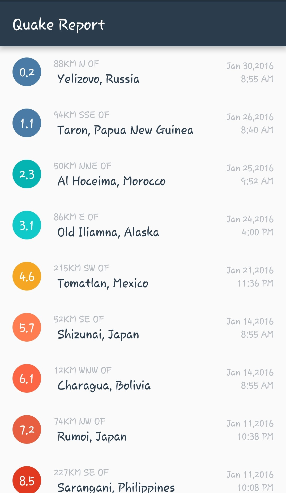
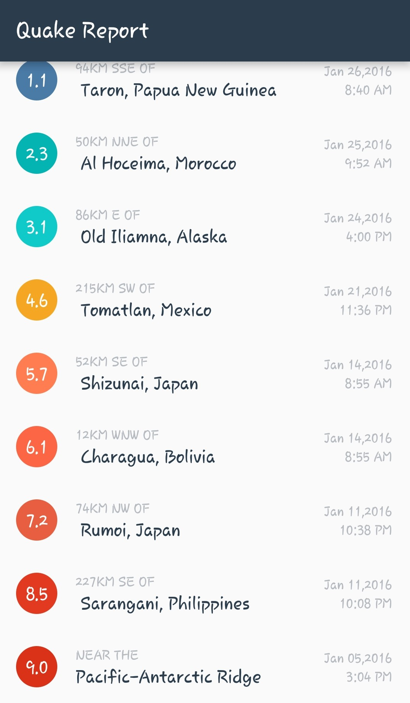

# QuakeReport_App

WHAT IS QUAKEREPORT APP ? 
This android app is designed for giving the information about the past earthquakes with it's complete details such as location,time,magnitude and date using the USGS api.

<h1> Have a look at the images linked below: <h1> 
  
   
  
  
  
